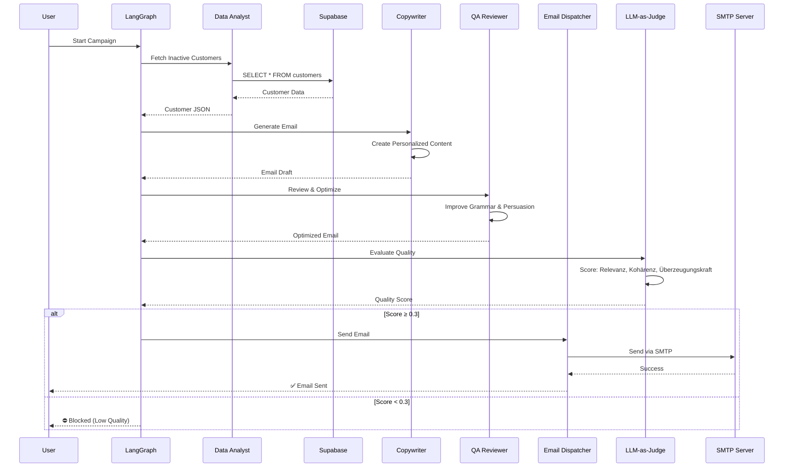

cat << 'EOF' > README.md
# 🛒 E-Commerce AI Re-Engagement System

## 📋 Projektübersicht

Dieses Projekt implementiert ein **produktionsnahes Multi-Agenten-System** zur automatisierten Kundenrückgewinnung im E-Commerce. Es kombiniert moderne AI-Frameworks mit robuster Fehlerbehandlung und Qualitätssicherung durch LLM-basierte Evaluation.

Das System identifiziert inaktive Kunden aus einer PostgreSQL-Datenbank, generiert personalisierte Re-Engagement-E-Mails und versendet diese über SMTP. Ein dedizierter **LLM-as-Judge** bewertet jede generierte E-Mail auf Relevanz, Kohärenz und Überzeugungskraft, bevor sie den Kunden erreicht. Dies stellt sicher, dass nur hochwertige, fehlerfreie Inhalte versendet werden.

Besonderes Augenmerk liegt auf **Kostenkontrolle und Datenschutz**: Das gesamte System läuft mit lokalen LLMs (Ollama + Llama 3.2) auf einem VPS, ohne externe API-Kosten und ohne Daten an Drittanbieter zu senden. Die Architektur ist bewusst fehlertolerant designed - robuste Parser und Guard Clauses verhindern, dass KI-Halluzinationen oder leere Inhalte zu fehlerhaften E-Mails führen.

Dieses Projekt demonstriert **AI Engineering Practices**: State-Management mit LangGraph, Multi-Agent-Kollaboration mit CrewAI, Custom Tool-Integration, LLM-as-Judge Evaluation und JSON-Parsing für unzuverlässige KI-Outputs.

---

## 🏗 Architektur & Tech Stack

- **Orchestrierung:** [LangGraph](https://langchain-ai.github.io/langgraph/) (State-Machine für kontrollierte Workflows)
- **Multi-Agenten:** [CrewAI](https://www.crewai.com/) (Rollenbasierte Kollaboration von 4 spezialisierten Agenten)
- **Datenmodellierung:** [Pydantic](https://docs.pydantic.dev/) (Strikte Typisierung und Validierung)
- **Datenbank:** [Supabase](https://supabase.com/) (PostgreSQL)
- **Lokales LLM:** [Ollama](https://ollama.com/) mit Llama 3.2 (100% lokal, keine API-Kosten)
- **Evaluation:** Custom LLM-as-Judge (Relevanz, Kohärenz, Überzeugungskraft)
- **Testing:** [Pytest](https://docs.pytest.org/)
- **UI:** [Streamlit](https://streamlit.io/)

---

### System Architektur

subgraph "Orchestration Layer"
    LG[LangGraph State Machine]
    LG -->|State Management| LG
end

subgraph "Multi-Agent System (CrewAI)"
    direction TB
    A1[Data Analyst Agent]
    A2[Copywriter Agent]
    A3[QA Reviewer Agent]
    A4[Email Dispatcher Agent]
    
    A1 -->|Kundendaten| A2
    A2 -->|E-Mail Entwurf| A3
    A3 -->|Optimierter Text| A4
end

subgraph "Tools & Integrations"
    T1[Supabase Tool]
    T2[SMTP Email Tool]
end

subgraph "Data Layer"
    DB[(Supabase PostgreSQL)]
    SMTP[SMTP Server]
end

subgraph "AI Infrastructure"
    OLLAMA[Ollama + Llama 3.2]
    EVAL[LLM-as-Judge Evaluation]
end

CLI --> LG
UI --> LG
LG -->|Execute Crew| A1

A1 -->|Fetch Inactive Customers| T1
T1 -->|Query| DB

A2 -->|Generate Email| OLLAMA
A3 -->|Review & Optimize| OLLAMA
A4 -->|Send Email| T2
T2 -->|SMTP Protocol| SMTP

A4 -->|Email Content| EVAL
EVAL -->|Score: Relevanz, Kohärenz, Überzeugungskraft| EVAL
EVAL -->|Quality Gate ≥ 0.3| A4

style LG fill:#e1f5ff
style OLLAMA fill:#fff4e1
style EVAL fill:#ffe1e1
style DB fill:#e1ffe1


### Datenfluss



---
## 🤖 Die 4 AI Agenten

### 1. **E-Commerce Data Analyst**
- **Rolle:** Datenbank-Experte
- **Aufgabe:** Fragt Supabase nach inaktiven Kunden ab und identifiziert Kaufmuster
- **Tool:** `fetch_inactive_customers` (Supabase API)

### 2. **E-Commerce Copywriter**
- **Rolle:** Personalisierter Texter
- **Aufgabe:** Erstellt hochkonvertierende Re-Engagement E-Mails basierend auf Kundendaten
- **Besonderheit:** Verwendet echte Kundendaten (Name, Kategorie, Datum) - keine Platzhalter

### 3. **Quality Assurance Reviewer**
- **Rolle:** Lektor & Optimierer
- **Aufgabe:** Prüft und optimiert den E-Mail-Entwurf auf Professionalität und Fehlerfreiheit
- **Ziel:** Grammatik, Rechtschreibung und Überzeugungskraft verbessern

### 4. **Email Dispatcher**
- **Rolle:** Technischer Operator
- **Aufgabe:** Versendet die finale, freigegebene E-Mail sicher via SMTP
- **Tool:** `send_email_tool` (SMTP mit Guard Clauses gegen leere Inhalte)

---

## 📊 Evaluation & Qualitätssicherung

Das System implementiert **LLM-as-a-Judge** mit drei Metriken:

1. **Relevanz (0-1):** Bezieht sich die E-Mail auf den Kunden und seine Kategorie?
2. **Kohärenz (0-1):** Ist der deutsche Text grammatikalisch korrekt und professionell?
3. **Überzeugungskraft (0-1):** Hat die E-Mail einen klaren Call-to-Action?

**Qualitäts-Gate:** Nur E-Mails mit einem Gesamt-Score ≥ 0.3 werden automatisch versendet. Niedrigere Scores blockieren den Versand und erfordern manuelle Prüfung.

---

## 🚀 Setup & Installation

### 1. Repository klonen
```bash
git clone <dein-repo-link>
cd ecommerce-ai-agenten
